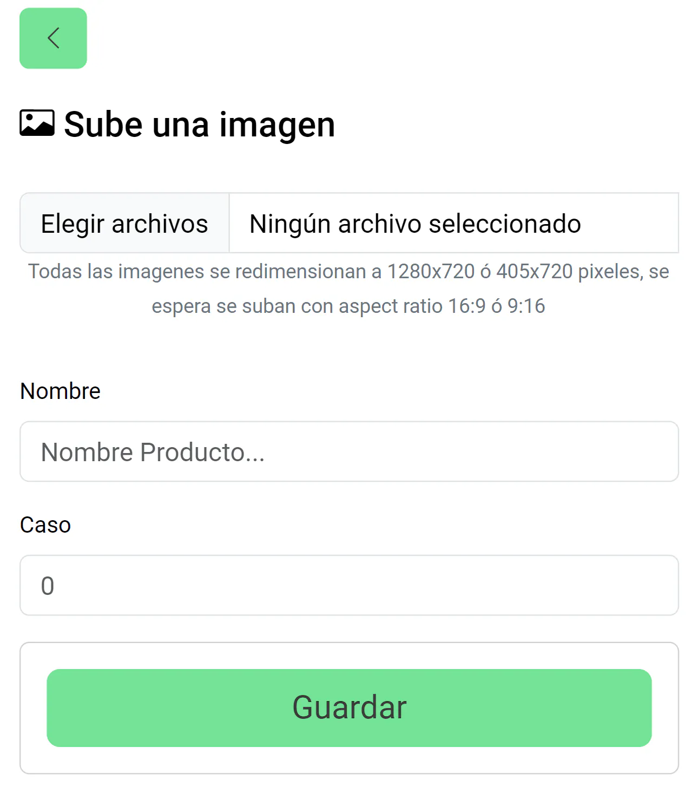
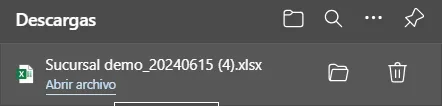
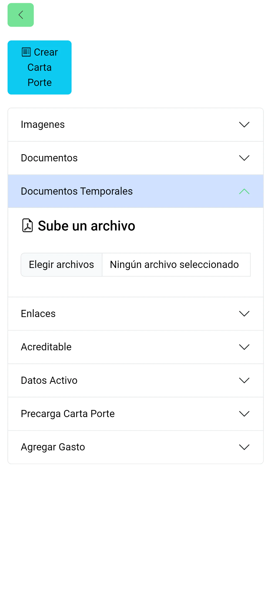
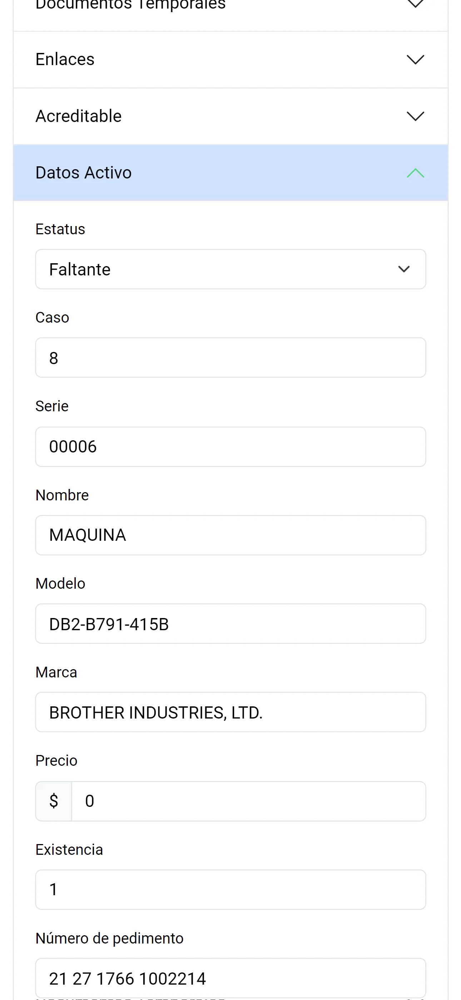
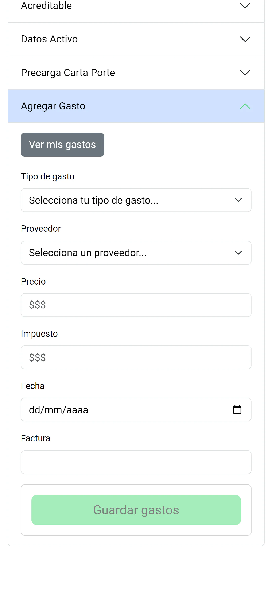
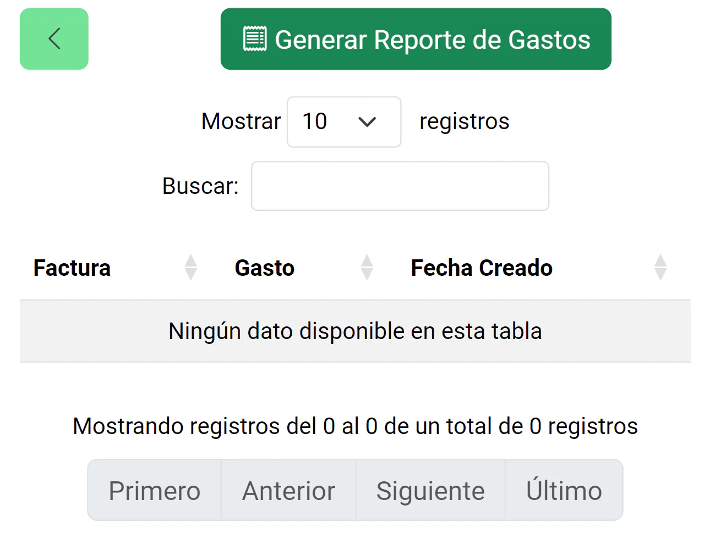

Encuentra la información clave de tus activos de forma simple, accediendo a tu sucursal, estos se mostrarán y desplegarán ciertas funciones interesantes para ti.

Tus activos se muestran de la siguiente forma:

- **Casos Activos**: Se trata de los activos que siguen con valor dentro del sistema, cuentan con cantidad en inventario y se pueden utilizar a lo largo del mismo.
- **Casos Pendientes**: Los activos que por una razón no estarán disponibles para su uso, pero que se encuentran dentro del sistema para mantener su registro.
  
Cada uno cumpliendo como diferenciador para conocer el estado en el que se encuentran.

> Todas las funciones asociadas a los activos para su creación y manipulación de datos se encuentran dentro de la siguiente funcionalidad

## Agregar activos a tu sucursal

Puedes agregar todos los Activos que quieras, para ello solo entra en la opción de "Agregar" en la cual, se te pedirá una imagen adjunta para tu activo, un nombre para reconocerlo y como opcional le asignes un numero de caso dentro de tu almacen.

## Filtra tus activos

Realiza el filtrado de tus activos en base al filtro personalizado que segun selecciones en tu activo, este filtro es para saber si tu activo tiene la documentacion completa o le falta informacion.

## Reporte de Activos

Obtén el reporte completo de todos los activos que se encuentren dentro de tu sucursal, con la información más reciente y lista para transportar al estar en un archivo Excel. Incluso te sera agradable solo seleccionar los activos que necesitas en tu reporte.

## Acciones rápidas

Puedes hacer cambios rápidos a tus activos, desde obtener link de enlace o un código QR que puedes descargar y enviar a más personas incluso sin un perfil creado, acceder a sus datos para poder editarlos y conocer más sobre ellos, asignarles una contraseña para poder fortificar su información al momento de compartirla, para que ningún intruso pueda acceder a ella, eliminarlo de tu sucursal, a pasarla de tipo de caso contrario del que se encuentra.

## Información completa de tus activos

Puedes acceder a toda la información de tus activos, esta se encuentra en diferentes menús desplegables y cada uno de ellos puede ser visto por los usuarios con acceso al enlace, o bien para los usuarios que desean editar sus características, entre ellas se encuentran las siguientes:

### Imágenes

Aquí se encuentran todas las imágenes almacenadas de los activos en cuestión, además de poder ingresar más en el modo de edición.

### Documentos

Se encuentran los documentos con los que cuenta el activo, en el modo de edición podrás agregar más, actualizar el nombre con el que se han guardado, darles una contraseña para que, aunque se pueda acceder a los datos, no se pueda hacer lo mismo con sus documentos o bien, eliminarlos.

Es importante mencionar que los documentos con contraseña seguirán apareciendo dentro de la vista compartida por medio del enlace, pero no se podrán acceder a menos que se introduzca la contraseña correcta.

### Documentos Temporales

Funcionan de la misma forma que los propios documentos, pudiendose mostrar en la vista compartida y agregar más dentro del modo edición.

### Enlaces

Son los enlaces con los cuales los activos cuentan, estos pueden ser de diferentes sitios web y estarán disponibles para cualquiera que tenga acceso a esta información, pudiendo agregar, editar o eliminarlos.

### Acreditable

En esta seccion el usuario podra asignar al activo como acreditable ante las autoridades o no, dejar registro de ello y asignar una mensaje para identificar mejor la decision.

### Datos del Activo

Muestran la información más detallada del activo, como su cantidad en inventario, precios, marca, modelo, etc.
Estos pueden ser editados en el modo edición.

### Precarga de datos de Carta Porte

Se puede cargar desde esta seccion los datos comunes que se incluyen dentro de la carpta porte esto para ser timbrada por medio de un CFDI y la informacion del transporte este correcta ante las autoridades.

### Gastos

Se presenta la capacidad de agregar gastos en un activo en concreto, la cantidad de los mismos es indefinida por lo que el recuento completo de los mismos puede ser almacenado aquí mismo.

Además de esto, para poder conocer los gastos que realizaron al activo, también se cuenta con su propia visualización, accesible al presionar el botón de "Ver mis gastos".

Puedes conocer los gastos relacionados con tus activos, en los cuales se encuentra todo el histórico con las facultades de edición y eliminación, además de poder generar el Reporte de Gastos con la información conglomerada de cada gasto realizado, este reporte viene en formato de archivo Excel.

