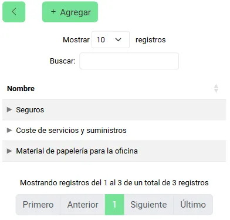
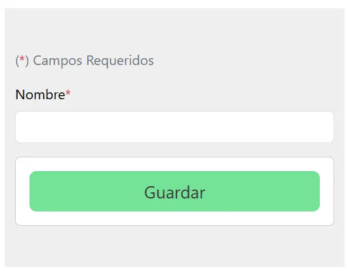
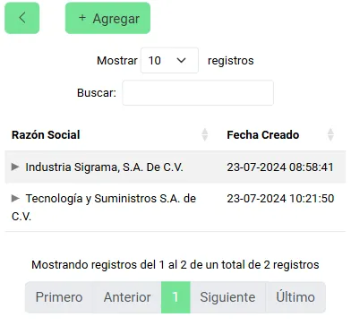
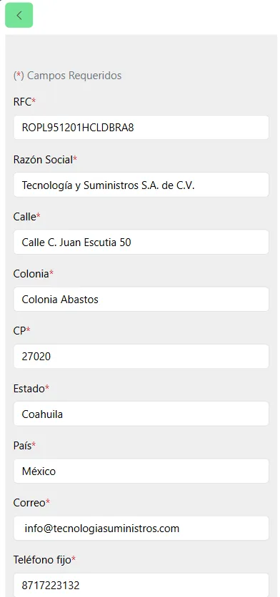
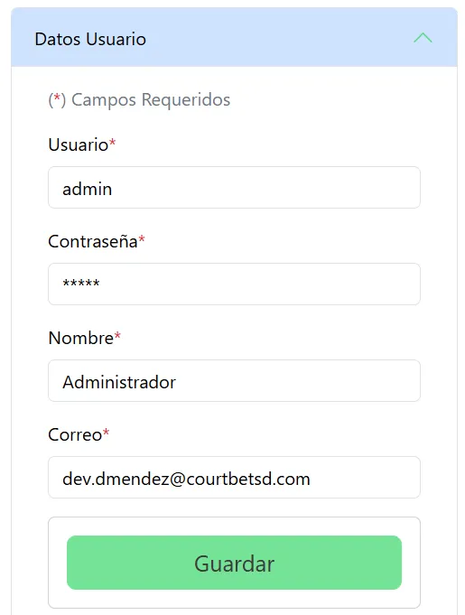
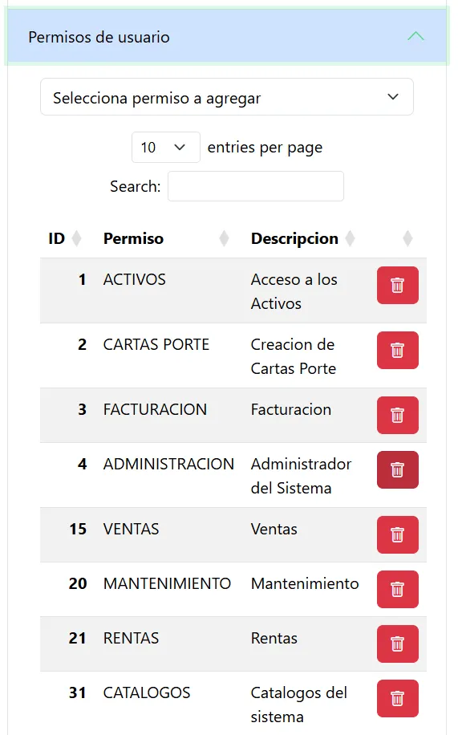
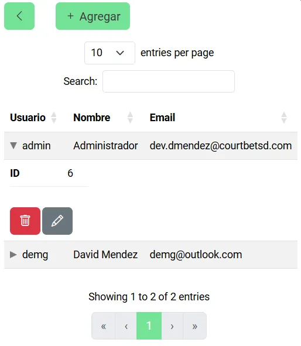
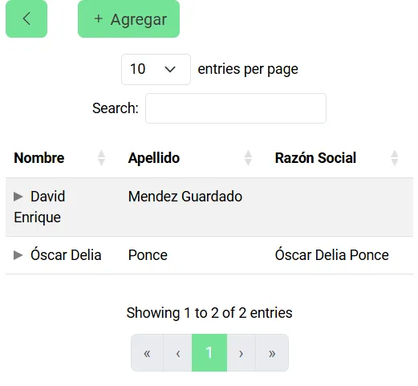

# Catálogos

Los catálogos brindan información que se utilizará en los módulos y para diferentes fines, con esta información a la mano, se puede dar mayor contexto y soporte al personal, a los clientes, los gastos y proveedores que tengas asociados a la orden de tus activos.

### Clientes

  Puedes observar la información de los clientes que se tengan registrados en la aplicación, estos pueden ser creados a tu disposición para sus futuras acciones de compra o venta, además de poder conocer y editar sus datos, así como poder eliminarlos.
  
  

  Para agregar a un nuevo cliente basta con llenar el formulario que se muestra al entrar a la opción de "Agregar" ya que esta te mostrará la información requerida, este mismo se muestra al querer acceder a su información completa y en el modo edición, mostrando no solo los datos generales, también su información de contacto.

  

  La información de contacto asociada sirve para poder mantener la facilidad y cercanía al momento de querer comunicarse con el cliente, esta información puede variar dependiendo de lo que se desee ingresar, siendo mostrada con sus facultades para agregar más datos, editar lo que ya tiene el cliente o eliminar los erróneos.

   

   Para poder crear o editar la información de los datos de contacto, solo se necesita llenar el formulario con la información mostrada.

   

### Usuarios

  Para que tus usuarios puedan acceder al sistema, se les puede generar nuevos perfiles para que puedan iniciar su sesión e ingresar al sistema, estos pueden tener todas las facultades que se desee que puedan ejercer, teniendo de primera mano un vistazo a los que ya existen actualmente.
  
  

  Estos mismos pueden ser agregados y eliminados del sistema según se requiera, y al desear actualizar su información se podrá editar su información general, junto con los permisos de los que el usuario goza, permitiendo el poder agregarle más o eliminar los que ya tiene aunados a él.

 
 

### Tipos de Gastos

  Aquí puedes conocer los tipos de gastos que se pueden asociar al catálogo de gastos de tus activos, además de poder agregar más registros para futuros gastos extra, editar los ya existentes y eliminarlos.
  
  

Esta función de agregar y actualizar, se cumple ingresando la información deseada dentro del formulario que se encarga de guardar todos los cambios ocurridos.

### Proveedores

  Se puede conocer la información de todos los proveedores con los que se trabajará para dar apoyo a tus activos, aquí, puedes conocer la información de cada uno de ellos, además de poder agregar nuevos al sistema, editar los que ya existen o darlos de baja.
  
  

Tanto si deseas agregar o actualizar los datos de los ya existentes, es necesario rellenar el formulario con sus datos para que estos se guarden efectivamente.

  

### Actualizar ítems

  Se puede actualizar un activo sin la necesidad de un formulario, esto gracias a que el sistema cuenta con una integración con Excel, en el cual, el archivo ingresado modifica los valores del mismo, además de que una vez completado se puede obtener la información de los cambios realizados.

  Para ello se puede descargar un archivo de Excel que contiene el formato requerido para hacer estos cambios, una vez obtenido, el llenado es simple, pidiendo la información del activo y los valores por cambiar, para posteriormente subir el archivo.

  Si alguno de los datos ingresados es erróneo, está todo bajo control, ya que el sistema te menciona cuál de todos los registros ingresados no fue encontrado y, por lo tanto, no hubo cambios, salvando la integridad de la información.
  
  

