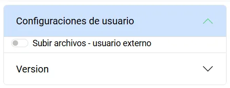
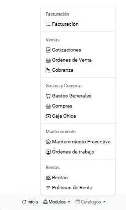

En tu interfaz, encontrarás diferentes vistas que se utilizan para cada módulo, estos, con sus propias funciones y capacidades únicas, pero ciertos elementos de navegación son constantes para cambiar de vista de forma sencilla, estos, diferenciados en diferentes campos:

## Usuario

Se muestran las diferentes capacidades rápidas con las cuales el usuario puede interactuar con el servicio.


En esta primera opción, se podrá acceder a diferentes configuraciones que pueden ser aplicadas a lo largo de la aplicación en la que se encuentre el usuario, definiendo reglas ya establecidas para su uso.

Además, se puede encontrar la versión actual del sistema, así como el registro de todas las versiones anteriores, que han ido agregando más interacción, funciones y mejoras al sistema, muy útiles para observar el cambio constante del sistema.




## Barra de navegación

Para mejorar la navegación entre los diferentes módulos del sistema, este cuenta con una barra de navegación con todas las funcionalidades registradas y funcionales con las que se puede interactuar, estas son diferenciadas por 3 secciones.

### Inicio

Puedes volver desde donde estés hacia la vista de inicio, en donde puedes elegir el almacén en el cual empezar a trabajar tus activos.
  


### Módulos

Los módulos constan de toda la funcionalidad con la que cuenta el sistema, cada una de ellas sirviendo para un fin en concreto, estas son las siguientes:

```
- Facturación.
  - Facturación.
- Ventas.
  - Cotizaciones.
  - Órdenes de venta.
  - Cobranza
- Gastos y Compras.
  - Gastos Generales.
  - Compras.
  - Caja Chica.
- Mantenimiento.
  - Mantenimiento Preventivo.
  - Órdenes de trabajo.
- Rentas.
  - Rentas.
  - Políticas de Renta
```



### Catálogos

También se cuenta con lo necesario para poder administrar información de tus usuarios en el sistema, además de valores utilizados para la configuración de tus activos, con la facultad extra de poder actualizar los mismos de una forma especial, estas capacidades incluyen:

```
- Clientes.
- Usuarios.
- Tipos de Gastos.
- Proveedores.
- Funciones.
  - Actualizar ítems.
```


