# Módulos

Los módulos otorgan múltiples capacidades para el usuario, para que pueda interactuar con los activos, sus movimientos, transacciones y en general, con los datos que se encuentran dentro del sistema.

### Cotizaciones

  Se puede cotizar por cliente un producto, acordando entre su información más valores de los productos, aquí se define cada registro por cliente, separándolos para mayor orden, permitiendo agregar más cotizaciones y el acceso al modo edición, que cuenta con información extra además de poder editar los valores de este registro.
  
  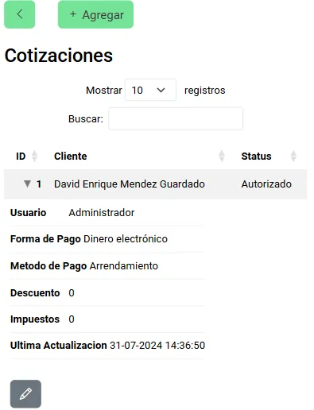

  En el formulario de creación, al usuario se le solicitará la información mostrada, identificando qué cliente desea cotizar y ciertas pautas extras que afectarán a la resolución del mismo.

  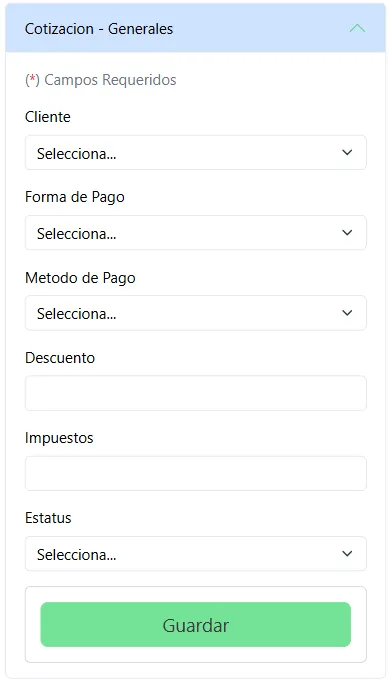

  Los productos encontrados dentro de la cotización se muestran en la tabla con su propia división, estos pueden ser agregados, editados y eliminados para llenar la información de los activos que el cliente solicita cotizar.

  Para poder agregar un nuevo activo a esta cotización, se necesita que el usuario agregue los mismos, seleccionado los que el cliente requiera.

   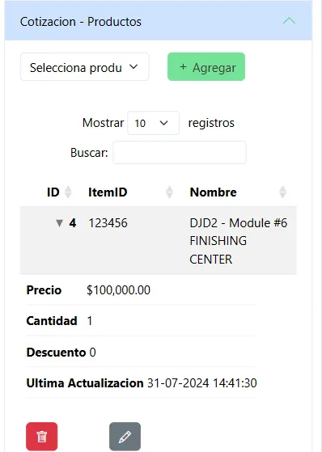

   Se pueden editar los valores de un producto cotizado, estos siendo definidos por el usuario para que se apliquen en la cotización del cliente y afectando al total del mismo.

   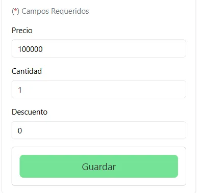

   Los datos de los activos cotizados terminan siendo calculados para brindarle al usuario y al cliente la información completa de los activos que se tiene agregados.

   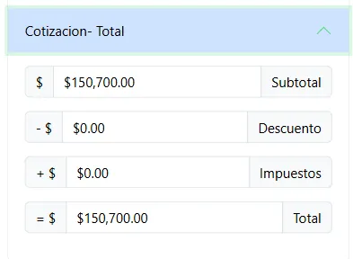

   Esta información puede ser enviada hacia el correo del cliente para que cuente con los datos completos de su cotización.

   

### Órdenes de venta

  Para cada venta realizada en el sistema, se puede guardar un registro que contenga la información más relevante y que permita al usuario conocer en qué estado se encuentra este, permitiendo agregar y entrar en el modo edición.
  
  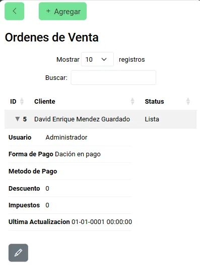

  Dentro del formulario para crear, se encuentran los campos requeridos que necesitan ser llenados, permitiendo al usuario el guardarlos, este formulario es utilizado en el modo edición para mostrar los valores con los que este registro cuenta actualmente, además de contar con mayor información de esta orden.

 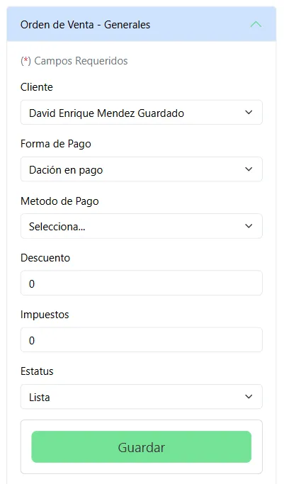

 Para cada orden, esta cuenta con la información de los productos ingresados, estos son mostrados dentro de una tabla que permite conocer, ingresar, editar y eliminar estos datos de los productos adjuntos.

 Para poder ingresar uno nuevo, solo se necesita que el usuario seleccione del listado de activos y presione el botón "Agregar".

 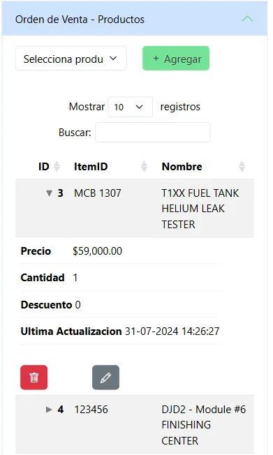

En el formulario para editar este registro del producto, se puede modificar el valor por el cual se hacen los cobros, la cantidad en que esta es comprada y si se le desea aplicar un porcentaje de descuento por activo.

 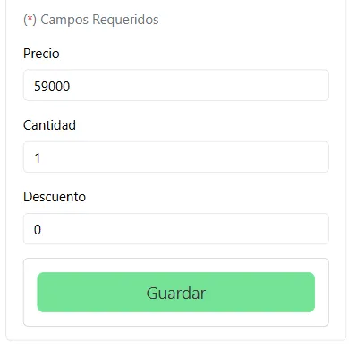

Se muestra el total de esta orden de venta, tomando en cuenta los valores ingresados en los registros de los productos asociados a esta orden.

 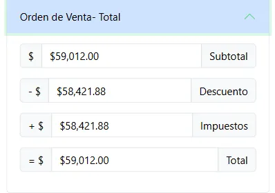

Toda esta información puede ser enviada hacia el cliente que ha hecho esta compra por medio del correo electrónico con el que este fue ingresado.

 

### Cobranza

  El módulo de cobranza toma en cuenta los valores de las órdenes de venta, los cuales, requerirán de seguimiento para poder completar los cobros de los mismos, mostrando sus datos y permitiendo entrar al modo edición que cuenta con más información relacionada con la cobranza.
  
  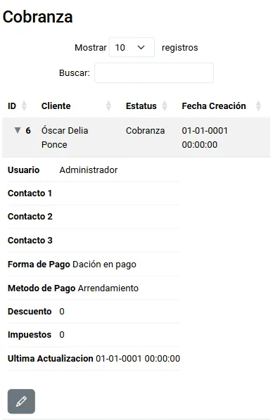

En el modo edición se puede conocer la información de los cobros, permitiendo agregar y editar los ya existentes para mantener el historial de cada movimiento.

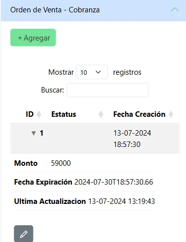

Para poder crear y editar estos valores, se da uso de un formulario que menciona los datos requeridos al usuario.

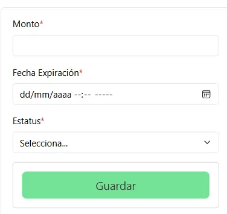

### Gastos Generales

  Se puede conocer la información de los gastos generales, identificando dentro de los mismos como parte de tu almacén, estos siendo mostrados con las capacidades de poder agrega más registros, editarlos, eliminarlos y de poder observar el archivo ingresado como váucher.
  
  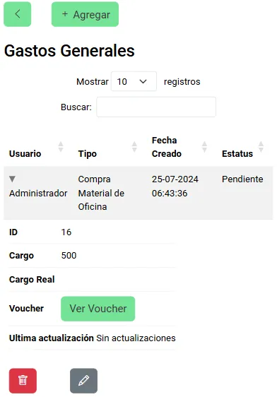
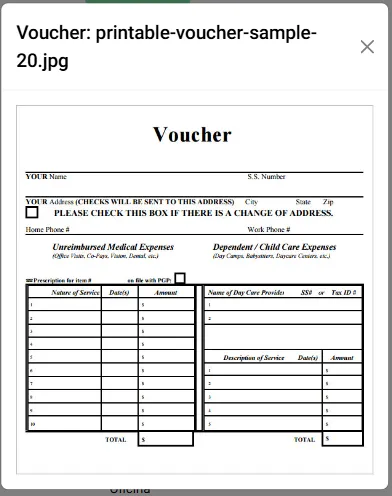

Para poder agregar un nuevo registro se necesita llenar la información solicitada dentro del formulario, solicitando además de los datos, un archivo que cuente con el váucher, este siendo válido si se encuentra en un formato de imagen o PDF.

  

En casos de requerir una actualización, los únicos campos admisibles son el envío de un archivo nuevo con el váucher en caso de enviar uno erróneo, además del estatus de este gasto.

  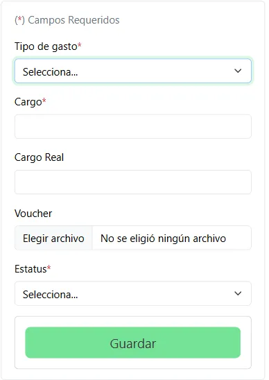

### Compras

  Se puede conocer la información esencial de una compra accediendo a su módulo, en este se conoce la información de a qué proveedor se le ha comprado, quién lo hizo, y el nivel de prioridad con el que cuenta, pudiendo así crear más registros de compras realizadas y entrar al modo edición.
  
  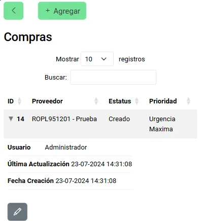

  Para poder crear, se encuentra el formulario con la información solicitada, este mismo pudiendo ser utilizado por el modo edición para editar ciertos datos de la compra.

  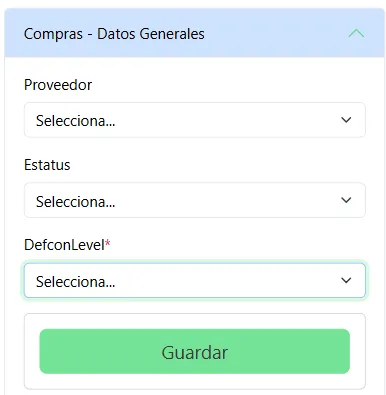

  En el modo edición se puede obtener más información del registro, además de actualizar su estado y nivel de prioridad.

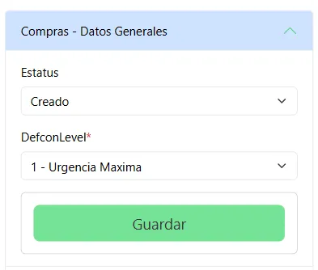

Se puede conocer la información de los detalles asociados a esta compra, pudiendo agregar más para que este termine siendo acumulado en el historial de esta compra, editando sus valores y eliminando los registros incorrectos.

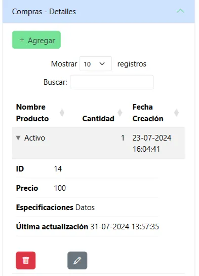

Además, se puede obtener el total de esta compra, obtenida en base a los movimientos efectuados dentro de los detalles de la compra, diferenciando el subtotal, los impuestos y descuentos aplicados, para mostrar el total de esta compra en tiempo real.

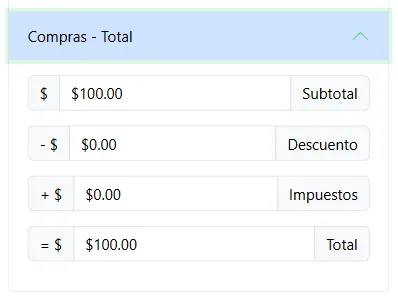

Se puede obtener toda la información de esta compra directamente en el correo electrónico del usuario en sesión.

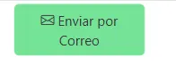

### Caja Chica

  La caja chica permite ingresar valores de apertura y cierre de cajas, estas, cuentan con información que se puede desempaquetar en más información, esta, agregándole contexto y valores referidos que afectarán a este registro único, entre las opciones se encuentra el poder agregar una nueva caja chica, y el acceso al modo edición que contiene más información y la capacidad de modificar los valores.
  
  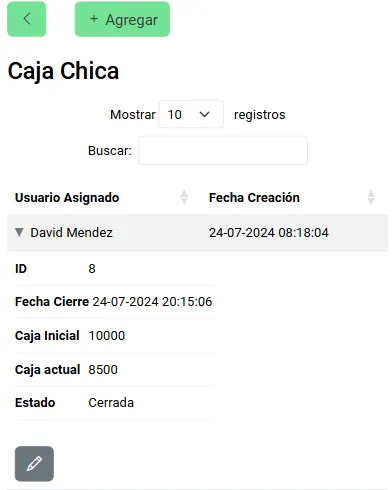

  Para crear un nuevo registro de caja chica, se le solicita que ingrese la información en el formulario, esta información da mayor conocimiento del mismo además de ser la piedra angular de los siguientes valores encontrados en el modo edición.

  Dentro del modo edición se puede modificar estos valores ingresados, dando uso del mismo formulario que el usado al momento de crear, pero pudiendo modificar únicamente el estado en que esta caja chica se encuentra.

  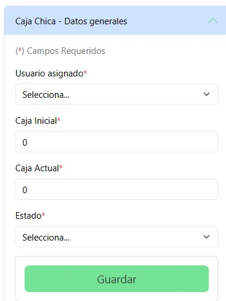

  En el caso anterior, se puede ver que el estado en que se encuentra es "Cerrada", lo cual nos indica que esta caja ya no puede ser operada debido a que los movimientos son bloqueados por cada cierre de caja, esto ocurre por diversos motivos, entre ellos, que el usuario decida cerrarla, por lo que los movimientos que se pueden realizar pasan a solo ser observables.

   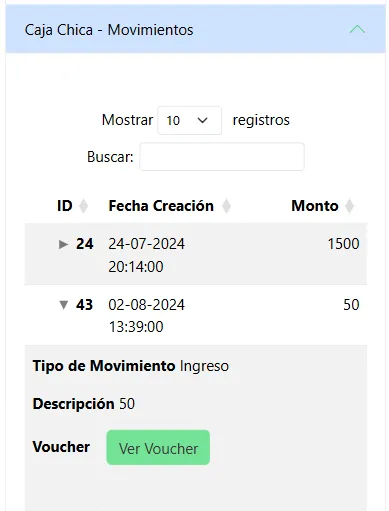

   Por otro lado, si esta caja resulta estar "Abierta", se permite el ingreso y eliminación de los mismos.

   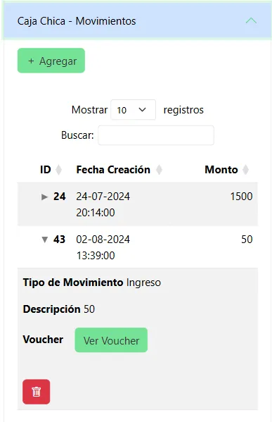

   Se pueden ingresar más movimientos a la caja chica llenando la información requerida.

   Además, si se cuenta con un váucher para poder adjuntarle más contexto, este permite la entrada de imágenes del documento o archivos PDF.

   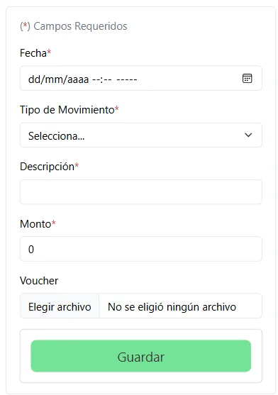

   Finalmente, en la tabla se puede ver la información relacionada a este archivo ingresado, esta misma se presenta dentro del sistema para que pueda ser observado.

   

### Mantenimiento Preventivo

  Se le puede dar un mantenimiento preventivo a los activos con los que se cuentan dentro de los almacénes, se pueden crear nuevos registros que declaren la acción que requieren los activos, además de poder suprimirlos.
  
  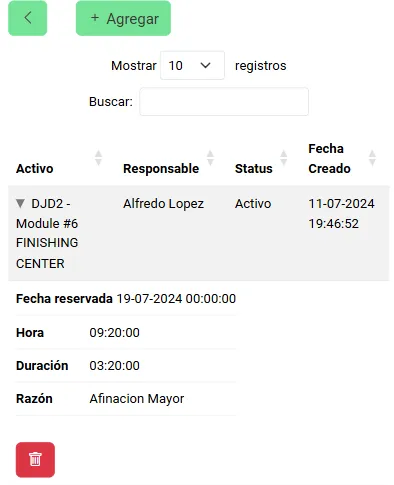

  Para poder registrar un nuevo mantenimiento preventivo, solo se necesita llenar la siguiente información dentro del formulario brindado al presionar el botón de "Agregar".

 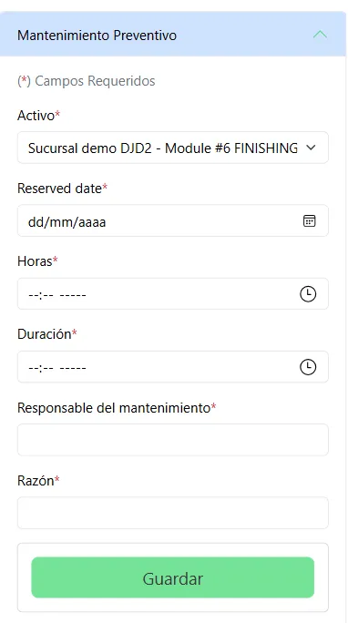

### Órdenes de Trabajo

  Las órdenes de trabajo permiten agregar, editar y eliminar la información referida a las indicaciones dadas hacia los usuarios, estas órdenes sirven para dictaminar labores que se necesitan hacer hacia un activo en concreto, contando además con la información de cuándo y los costos de este trabajo.
  
  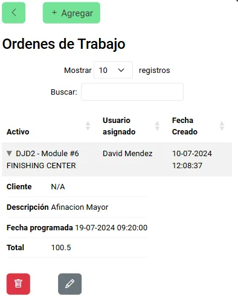

Al desear agregar una nueva orden de trabajo, esta puede contar todas las facultades disponibles para poder dar detalle y contexto al trabajo requerido y bajo qué conceptos se debe de cumplir.

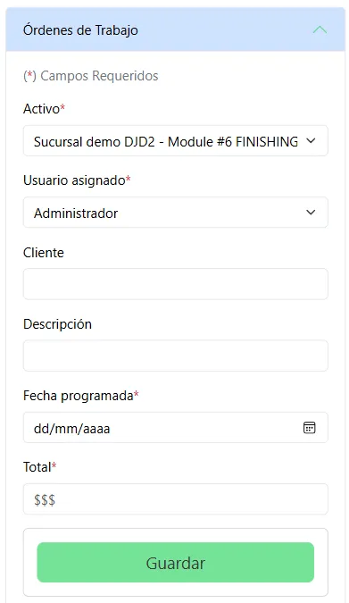

En el modo edición, la información de la orden de trabajo se amplía, comenzando por el campo de datos generales en el que se pueden editar los valores existentes, a excepción del activo al que esta labor se le hará.

Además de encontrarse un apartado que brinda más detalles a esta orden de trabajo en concreto.

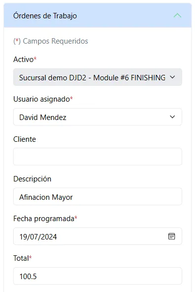

La información de estos detalles brinda más información acerca de esta orden en concreto, permitiendo además de conocer los registros ya existentes, el poder agregar, eliminar y actualizarlos.

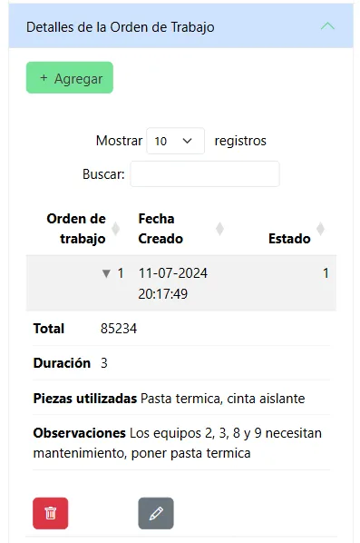

Para agregar o editar los registros, se puede dar uso de este formulario que busca la información necesaria, dándole indicaciones al usuario de lo que hace falta para la creación/actualización.

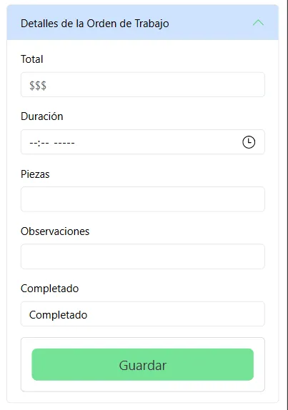

Finalmente se cuenta con un botón que permite enviar toda esta información de las órdenes de trabajo hacia el correo electrónico asociado al usuario con la sesión activa.

### Rentas

  Las rentas permiten la transacción de los activos hacia externos, esto se puede hacer en una modalidad en la que el cliente pague mensualmente por su uso, además de que esta misma cuenta con la información necesaria para adjuntar los movimientos efectuados dentro de cada registro nuevo, en las rentas, se puede conocer la información de este único hecho, actualizarlo y entrar en el modo edición que muestra más información, además de permitir la actualización de los datos.
  
  Además, cuenta con una funcionalidad que permite notificar a los usuarios que cierta renta está próxima a llegar a su fecha de vencimiento.

  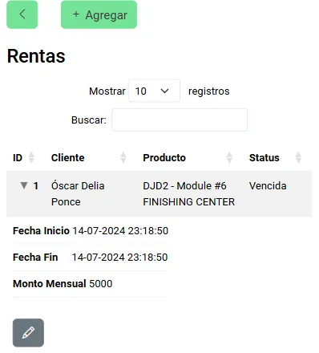
  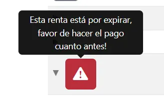

En el modo edición se encuentra la información de tu registro de renta buscado, el cual puede ser modificado a tu disposición, en la parte inferior se puede acceder además a los cobros relacionados con esta renta.

  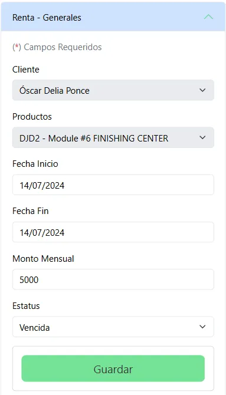

Los pagos efectuados en tus rentas se pueden encontrar aquí, estos cumpliendo como registro de lo que se ha hecho con esta renta específica, pudiendo así agregar movimientos realizados, modificar sus datos y eliminarlos.

  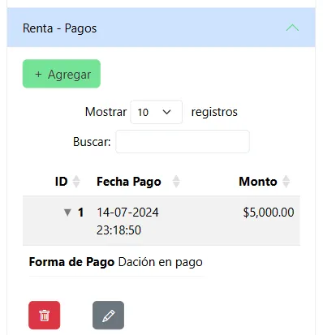

Estos nuevos movimientos pueden ser registrados en el formulario encargado de crearlos, además de poder editarlos en el mismo.

  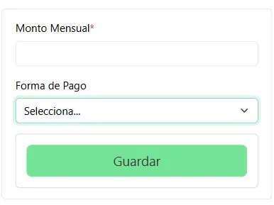

### Políticas de Renta

  Las rentas pueden ser alteradas según las diferentes políticas que puedes ingresar directamente dentro del sistema, para ello solo hace falta acceder dentro del mismo y se encontrará la tabla con todas las reglas que se aplicarán, pudiendo agregar más para complementar futuras restas, eliminarlas y editar su información.
  
  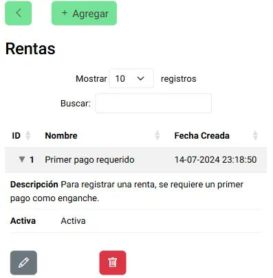

  Una vez dentro de la creación o edición de las políticas, la información que se pide es la misma y consta de un formulario simple que requiere del nombre de la política, además de las pautas descritas para las rentas.

   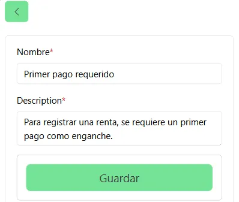
